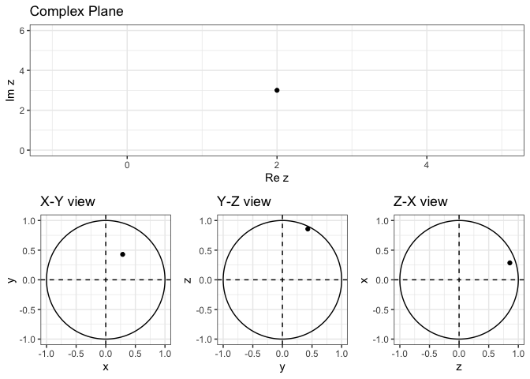

# complexR 

<!-- badges: start -->

[](https://lifecycle.r-lib.org/articles/stages.html#experimental)
[](https://CRAN.R-project.org/package=ipl)
[](https://github.com/Swaha294/complexR/actions/workflows/R-CMD-check.yaml)
<!-- badges: end -->

## Overview

`complexR` is a tool for easily computing and visualizing
transformations on complex numbers:

- `circle_transform()` performs and visualizes any kind of
  transformation on circles

- `line_transform()` performs and visualizes any kind of transformation
  on lines

- `quad_transform()` performs and visualizes any kind of transformation
  on squares and rectangles

- `disc_transform()` performs and visualizes any kind of transformation
  on discs

- `plane_to_sphere()` and `sphere_to_plane()` compute stereographic
  projections

- `st_sphere_plot()` and `st_plane_plot()` visualize them.

These functions combine other intermediary functions like
`cart_to_polar()` and `polar_to_cart()` to execute their operations. You
can learn more about them in `vignette("complexR")`.

## Installation

Use this code to download the development version of `complexR`.

``` r
devtools::install_github("Swaha294/complexR")
```

    ## Skipping install of 'complexR' from a github remote, the SHA1 (b04d72dc) has not changed since last install.
    ##   Use `force = TRUE` to force installation

## Usage

Visualize the transformation $f(z) = 2xy + iy^2$ on the unit circle
centered at $(1, 0)$

``` r
library(complexR)
circle_transform(
  x0 = 1, 
  x_new = expression(2*x*y), 
  y_new = expression(y^2),
  annotations = c(complex(real = 2, imaginary = 0), complex(real = 1, imaginary = 1))
  )
```

<!-- -->

Visualize the transformation $f(x + iy) = (x^3 - y^2) + i(2xy)$ on the
disc $|z| < 1, \theta \in [0, \pi/3]$

``` r
disc_transform(
  x0 = 1, 
  y0 = 1, 
  x_new = expression(x^3 - y^2),
  y_new = expression(2*x*y), 
  theta_min = 0, 
  theta_max = pi/3
  )
```

<!-- -->

Visualize the stereographic projection of z = 2 + 3i in $\mathbb{C}$
onto the Riemann sphere $\mathbb{C}^*$

``` r
st_sphere_plot(2, 3)
```

<!-- -->
