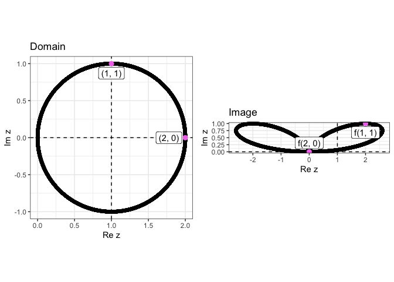
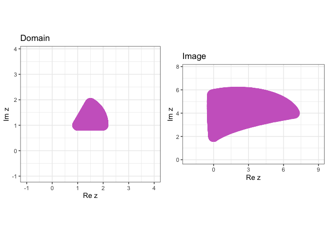

# complexR

## Overview

`complexR` is a tool for easily computing and visualizing
transformations on complex numbers:

- `circle_transform()` performs and visualizes any kind of
  transformation on circles

- `line_transform()` performs and visualizes any kind of transformation
  on lines

- `quad_transform()` performs and visualizes any kind of transformation
  on squares and rectangles

- `plane_to_sphere()` and `sphere_to_plane()` compute stereographic
  projections

- `st_sphere_plot()` and `st_plane_plot()` visualize them.

These functions combine other intermediary functions like
`cart_to_polar()` and `polar_to_cart()` to execute their operations. You
can learn more about them in `vignette("complexR")`.

## Installation

Use this code to download the development version of `complexR`.

``` r
devtools::install_github("Swaha294/complexR")
```

    ## Downloading GitHub repo Swaha294/complexR@HEAD

    ## 
    ##      checking for file ‘/private/var/folders/0p/hkwpsbqj047d4nq34kz3_wdr0000gn/T/RtmpphU44V/remotes3e4d70f25eb6/Swaha294-complexR-18a1ed2/DESCRIPTION’ ...  ✔  checking for file ‘/private/var/folders/0p/hkwpsbqj047d4nq34kz3_wdr0000gn/T/RtmpphU44V/remotes3e4d70f25eb6/Swaha294-complexR-18a1ed2/DESCRIPTION’ (335ms)
    ##   ─  preparing ‘complexR’:
    ##      checking DESCRIPTION meta-information ...  ✔  checking DESCRIPTION meta-information
    ##   ─  checking for LF line-endings in source and make files and shell scripts
    ##   ─  checking for empty or unneeded directories
    ##   ─  building ‘complexR_0.0.0.9000.tar.gz’
    ##      
    ## 

## Usage

Visualize the transformation $f(z) = 2xy + iy^2$ on the unit circle
centered at $(1, 0)$

``` r
library(complexR)
circle_transform(
  x0 = 1, 
  x_new = expression(2*x*y), 
  y_new = expression(y^2),
  annotations = c(complex(real = 2, imaginary = 0), complex(real = 1, imaginary = 1))
  )
```

<!-- -->

Visualize the transformation $f(z) = 2x^2 + i(y^2 - x^2)$ on the line
$y = 3x - 10$

``` r
line_transform(
  m = 3, 
  c = -10,
  x_new = expression(x^2), 
  y_new = expression(y^2 - x^2)
  )
```

<!-- -->
